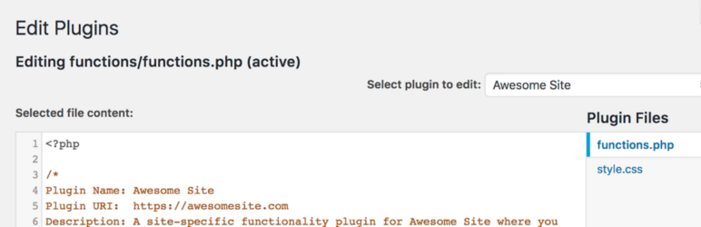

# Functionality

A functionality plugin is a way to separate what you might normally place in a theme's `functions.php` file, and put it in a plugin instead. It works the same way as a theme `functions.php` file, but is separate from the theme and so not affected by theme upgrades, or tied to the theme so you loose all of your functions if you choose to switch themes.

This plugin automates the process of creating a functionality plugin. Simply install and activate this plugin, and your very own functionality plugin will be created for you. You can then edit your functionality plugin and add snippets to it using the quick link in the admin menu.

See [this WP Daily post](http://wpdaily.co/functionality-plugin/) for more information on functionality plugins.

This plugin may be removed at any time, and your functionality plugin will remain working and intact. You will, however, loose the quick edit link in the admin menu.

